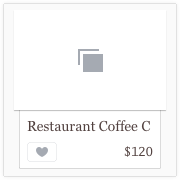

# Part.3

## Assignment

1. Please implement the UI. See details on the [Zeplin](https://zpl.io/bzYXEeG).

### Note

Please use **Auto Layout** in the whole project.

Please truncate a text when it reaches edges of another view.

### Hint

* Generating colorful icons with UIImage rendering mode `template` and tint color

### Resources

* [Assets](../../../resources/assets)
