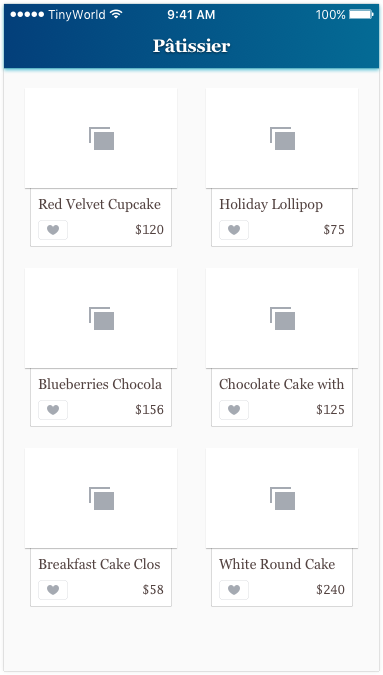

# Part.4

## Assignment

1. Please implement the UI. See details on the [Zeplin](https://zpl.io/bzYXEeG).
2. Please initialize six products from Product struct and assign them to a `products` array for displaying on the UI.

### Note

Please give any name and price you want for the Product instances in this assignment.

**DO NOT** forget the gradient effect for the background of the navigation bar.

### Hint

* UINavigatonController
* UICollectionViewController