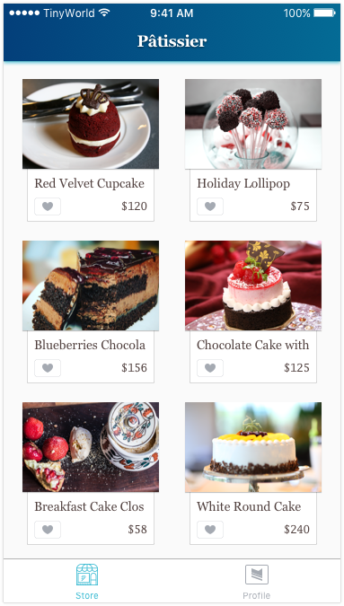
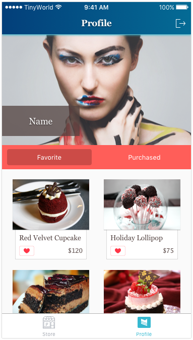
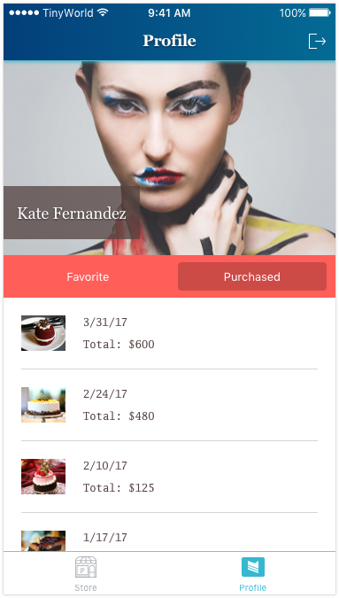
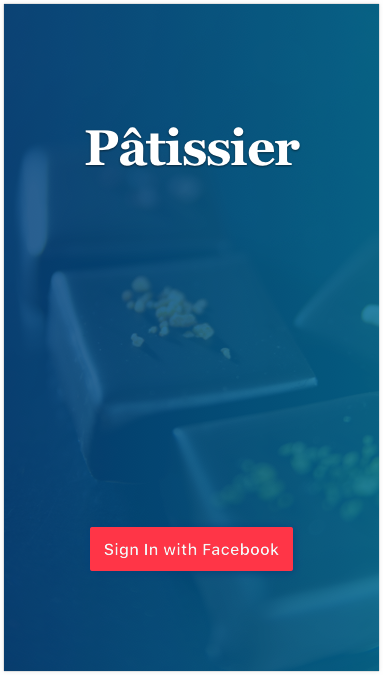

# Part.19

## Assignment

1. Please implement the UI. See details on the [Zeplin](https://zpl.io/bzYXEeG).
2. Please sign out the current user when selecting the exit button (on the top-right corner) in profile. The app should show sign-in UI after a user did sign out.

### Note

You must delete all user related data in the UserDefaults after signing out.

### Hint

* UITabBarController