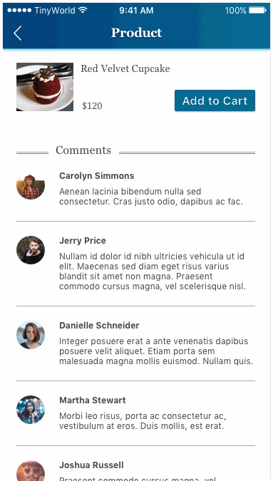
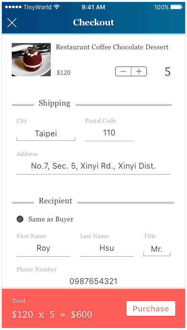

# Part.20

## API endpoint [POST /orders]

When creating an order, you must provide the essential information.
Please fill in the shipping address, a recipient (can be as the same as the buyer) for the order.
You can have at the least one or multiple items for a single order.

### Request

**Headers**

| Header | Value | Required |
| --- | --- | --- |
| Authorization | Bearer < jwt token > | v |
| Content-Type | application/json | v |

**Body**

| Parameter | Description | Required |
| --- | --- | --- |
| items | An array of items. | v |
| item.type | The item type. Please make sure the type is on the list of the supported items. | v |
| item.id | The item id. For example, If the item is product, then the id of this item is the product id. | v |
| item.quantity | The quantitiy of the items. | v |
| recipient.phone_number | The recipient's phone number. | v |
| recipient.first_name | The recipient's first name. | v |
| recipient.last_name | The recipient's last name. | v |
| recipient.title | The title of the recipient. Please make sure the title is on the list of the supported titles. | v |
| shipping.service | The shipping service. Please make sure the service is on the list of the supported services. | v |
| shipping.postal_code | The postal code of shipping address. (In Taiwan) | v |
| shipping.city | The shipping city. (In Taiwan) | v |
| shipping.address | The shipping address. (In Taiwan) | v |

**Supported Items**

| Item | Value |
| --- | --- |
| Product | PRODUCT |

**Supported Titles**

| Title | Value |
| --- | --- |
| Mister | MISTER |
| Miss | MISS |

**Supported Services**

| Service | Value |
| --- | --- |
| Post Office | POST_OFFICE |

Example

```json
{
  "items": [
    {
      "id": "591f03ad623394fae007fbf8",
      "type": "PRODUCT",
      "quantity": 2
    }
  ],
  "recipient": {
    "phone_number": "0987654321",
    "first_name": "Roy",
    "last_name": "Hsu",
    "title": "MISTER"
  },
  "shipping": {
    "service": "POST_OFFICE",
    "postal_code": "110",
    "city": "Taipei",
    "address": "No.7, Sec. 5, Xinyi Rd., Xinyi Dist."
  }
}
```

### Response 200 (application/json)

**Body**

| Parameter | Description |
| --- | --- |
| id | The id of the created order. |

Example

```json
{
  "data": {
    "id": "5931794f1606036128fe0bb8"
  }
}
```

## API endpoint [PATCH /orders/:id/transaction]

You can pay for an order with the supported payment methods.

### Request

**Headers**

| Header | Value | Required |
| --- | --- | --- |
| Authorization | Bearer < jwt token > | v |
| Content-Type | application/json | v |

**Body**

| Parameter | Description | Required |
| --- | --- | --- |
| payment_method | The payment method. Please make sure the method is on the list of the supported payment methods. | v |
| credit_card.number | The card number. | v |
| credit\_card.expiration\_month | The expiration month of the card with format: `MM`. | v |
| credit\_card.expiration\_year | The expiration year of the card with format: `yyyy`. | v |
| credti_card.code | The code of the card. | v |

**Supported Payment Methods**

| Method | Value |
| --- | --- |
| Credit Card | CREDIT_CARD |

Example

```json
{
  "payment_method": "CREDIT_CARD",
  "credit_card": {
    "number": "1234123412341234",
    "expiration_month": 12,
    "expiration_year": 2017,
    "code": "123"
  }
}
```

### Response 200 (application/json)

**Body**

| Parameter | Description |
| --- | --- |
| transaction_id | The transaction id for the order. |

Example

```json
{
  "data": {
    "transaction_id": "593179751606036129fe0bb8"
  }
}
```

## Assignment




1. Please show the checkout process when selecting the Add to Cart button.
2. Please implement the UI. See details on the [Zeplin](https://zpl.io/bzYXEeG).
3. Please keep the total amount section floating in the same position while scrolling. It will always be visible and fixed at the bottom of the screen.
4. Please process the checkout when selecting the Purchase button by implementing the `POST /orders` and `PATCH /orders/:id/transaction` APIs.

### Note

Please **DO NOT** use a read credit card to process the checkout. The server currently and only accepts the demo credit card listing below.

```
// The demo credit card.
Number: 1234123412341234
Expiration Year: < current year >
Expiration Month: 12
Code: 123
```

### Hint

* Present a UIViewController
