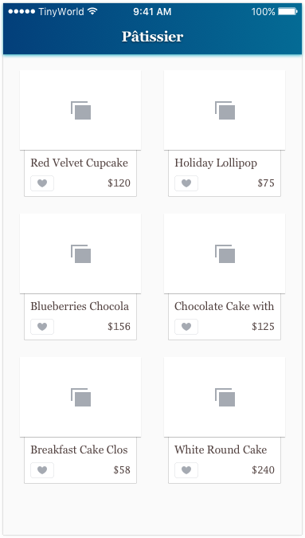

# Part.10

## Grand Central Dispatch (GCD)

1. [Grand Central Dispatch Tutorial for Swift: Part 1/2](https://www.raywenderlich.com/79149/grand-central-dispatch-tutorial-swift-part-1)
2. [Grand Central Dispatch Tutorial for Swift: Part 2/2](https://www.raywenderlich.com/79150/grand-central-dispatch-tutorial-swift-part-2)
3. [Grand Central Dispatch In-Depth: Part 1/2](https://www.raywenderlich.com/60749/grand-central-dispatch-in-depth-part-1)
4. [Grand Central Dispatch In-Depth: Part 2/2](https://www.raywenderlich.com/63338/grand-central-dispatch-in-depth-part-2)

## Assignment

1. Making HTTP requests in iOS is an asynchronous task. Please make `fetchProducts()` function go back to the main thread before calling the delegate functions.
2. Please use `ProductManager` to request products in product list view controller.
3. Please make product list view controller conform to `ProductManagerDelegate` protocol so that it can display the requested products from the server instead of the fake products in the previous assignment.

### Note

All UI stuff should only happen on the main thread, or it wouldn't act what you want it to be.