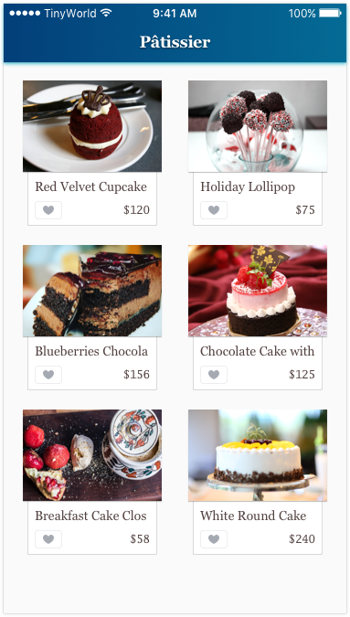

# Part.12

## Assignment

1. Please find a 3rd-party framework to load more data of products when a user scrolls down to the bottom of the list.
2. Please use the `GET /products?{paging}` API from the previous assignment to fetch more products.

### Note

We highly encourage you to put the Cocoapods at the first place for searching any 3rd-party frameworks.

You should **NOT** implement the load more functionality by yourself in this assignment.