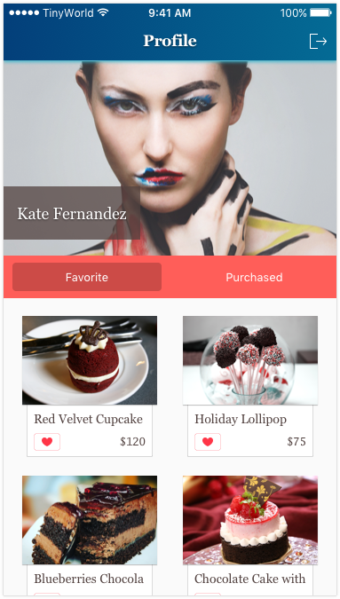

# Part.18

## Assignment

1. Please use `Target-Action` instead of `IBAction` to trigger the action of like / unlike button on the cells. The like action will store the product in `Core Data`; the unlike action will delete the product from `Core Data`.
2. Please retrieve the favorite products stored in `Core Data` and show them up on the UI.

### Hint

* NSFetchedResultsController